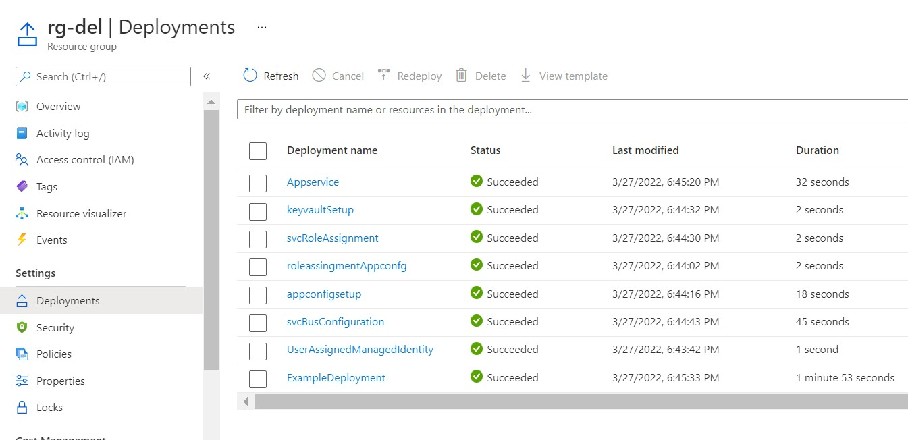

<h1> Contents </h1>

1. Create <a href='./user_Assigned_Identity'> user assgined managed Identity. </a>
2. Create an <a href='./appConfig/appconfig.bicep'> App configuration </a> with local auth disabled (for now)
3. Grant <a href='./appConfig/roleAssignments/appconfg.assignments.bicep'>AppConfigurationDataOwner' to my Id and the user assigned Idenity </a>   
4. Create a <a href='./keyvault/keyvault.bicep'> Keyvault </a> ,add access policies, store the app Configuration url as a secret and output the URL
5. Create a <a href='./service_bus/servicebus.bicep'> service Bus Topic </a> with local auth disabled
6. Assign the <a href='./service_bus/role_assignments/servicebus_roleAssignments.bicep'> Azure Service Bus Data Receiver </a> to the user assigned identity and my Id.
7. Create an <a href='./app_service/appservice.bicep'> app Service and assign the user assigned identity to it  and  add the keyvault url and MSIID to Appsettings </a>

<h3> OUTPUT </h3>

--------------- TODO ---------------
<ul>
<li> Create an Azure Ad App and secret </li>
<li> Put secret and client id in keyvault </li>
<li> Automate using Yaml </li>
<li> Create 4 endpoints CRUD</li>
<li> API tests using Newman </li>
</ul>
------------------------------------
